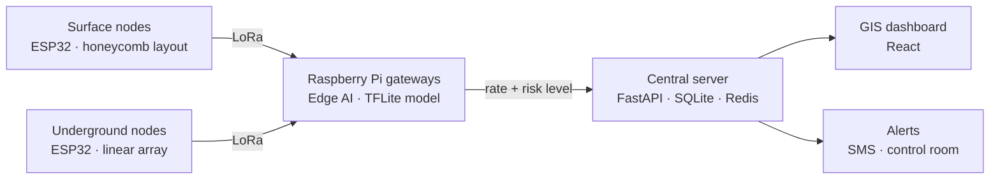

# MinePulse — Edge AI for Mine Subsidence Early Warning

> **Before the crack, comes the signal.**

MinePulse is a low-cost, real-time ground-deformation monitoring and early-warning system for underground coal mines in India. A dual-layer network of ESP32 sensor nodes (surface + underground) streams tension, tilt, vibration and environmental readings over LoRa to Raspberry Pi gateways, which run a small AI model locally and raise alerts before subsidence becomes a hazard.

This repository contains the Edge AI model: the training notebook, the quantised TensorFlow Lite model that runs on the Raspberry Pi gateway, and the code to run inference.

Built by **Team United Flag** for **Smart India Hackathon 2026 — PS 26025**: *Development of an AI-enabled Low Cost Real Time Mine Subsidence Monitoring, Prediction and Early Warning System for Underground Coal Mines in India* (Theme: Smart Automation, Category: Hardware).

---

## Demo & links

- 🎥 **Prototype demo video**: https://youtu.be/7r3KNuTeKfA
- 🌐 **Interactive 3D simulation (26-node network)**: https://minepulse-ecru.vercel.app/
- 📡 **Virtual prototype / telemetry interface**: https://subsisense-telemetry-1.onrender.com/
- 📷 **Prototype photos (wiring + 3D model)**: [Google Drive](https://drive.google.com/drive/folders/1ShTGeCjeX8JY6S3OWyL6evYAoNDg3akR?usp=sharing)
- 📊 **Sample sensor data used in the demo**: [Google Sheets](https://docs.google.com/spreadsheets/d/1QfrNndYKlAsNG4o7TDbulLNrrqf6b_7_1eckwZO-4XA/edit?usp=sharing)

---

## The problem

Ground movement in underground mines is usually checked through periodic inspection. A deformation that starts today may only be noticed at the next inspection cycle, by which point the window for preventive action may already be closing.

```
Periodic inspection → missed micro-deformation → delayed warning → worker risk
```

MinePulse replaces that gap with a continuous sensing layer that detects abnormal movement early and alerts mine-control staff while there is still time to act.

---

## How MinePulse works



1. **Dual-layer sensing.** Surface nodes are placed in a honeycomb pattern for coverage and cost efficiency. Underground nodes sit in straight-line arrays along roadways for spatial tracking. Each node carries:
   - a tension string with a load cell (the core MinePulse sensor: ground movement changes string tension)
   - a 6-axis IMU for tilt
   - a vibration sensor
   - a displacement / crack sensor
   - moisture and environmental sensors
2. **Grid-powered nodes.** Nodes draw power from the mine's existing electrical infrastructure through protection and regulation, an isolated AC-DC converter, and regulated 5 V / 3.3 V rails. No batteries or solar panels at each location.
3. **LoRa communication.** Nodes forward data over LoRa. Node spacing is calibrated in the field based on the mine's layout, depth and signal conditions.
4. **Edge AI.** Redundant Raspberry Pi gateways run the model in this repo locally, so warnings keep working even without continuous cloud connectivity.
5. **Early warning.** Each reading is classified as SAFE, WARNING or DANGER, pushed to a central dashboard, and escalated by SMS / control-room alerts so teams can inspect or evacuate.

---

## The Edge AI model

### What it predicts

The model takes one feature vector from a node and predicts the **subsidence rate in mm/day**. The predicted rate is then mapped to an alert level:

| Level | Predicted subsidence rate |
| :--- | :--- |
| 🟢 **SAFE** | below 0.5 mm/day |
| 🟡 **WARNING** | 0.5 to below 5 mm/day |
| 🔴 **DANGER** | 5 mm/day and above |

### Data

Trained on the public [Mine Subsidence Dataset](https://www.kaggle.com/datasets/swastisomwanshi/mine-subsidence-dataset) on Kaggle: about 2,000 time-stamped readings with 29 input features built from tilt, pressure, temperature and humidity, including rolling means (3 h, 6 h, 24 h), EWMA smoothing and interaction terms.

### Preprocessing decisions

- **Leakage removed.** Columns that secretly contain the answer were dropped: `danger_level` (a threshold on the target), `confidence_level`, `cumulative_drift` (a running counter that acts like a clock), and `vertical_settle_est` / `horizontal_shift_est` (exact functions of tilt).
- **Chronological split.** Trained on the first 80% of the timeline, tested on the most recent 20%. This mirrors real deployment, where the model always predicts the future from the past.
- **Log-transformed target.** Subsidence rates are skewed, so the model learns `log(1 + rate)`, standardised.
- **Feature scaling.** `StandardScaler` fitted on training data only. The scaler values are exported in `model_meta.json` so the gateway applies the exact same scaling.

### Architecture

A small fully connected network, chosen so it converts cleanly to TensorFlow Lite:

```
Input (29) → Dense 64 (ReLU) → Dropout 0.2 → Dense 32 (ReLU) → Dense 16 (ReLU) → Dense 1
```

4,545 parameters. Trained with Adam (lr 1e-3), MSE loss, early stopping and learning-rate reduction on plateau. Exported with dynamic-range quantisation to a 9.7 KB `.tflite` file.

### Results (held-out, most recent 20% of data)

| Model | MAE (mm/day) | RMSE (mm/day) | R² | Alert-level accuracy |
| :--- | :--- | :--- | :--- | :--- |
| Random Forest baseline | 1.12 | 1.91 | 0.83 | — |
| Neural network (Keras) | 1.36 | 2.55 | 0.70 | 72.0% |
| **Neural network (TFLite, quantised, deployed)** | **1.36** | — | **0.70** | **72.3%** |

Quantisation shrank the model to 9.7 KB with no meaningful loss in accuracy.

Per-level performance of the deployed TFLite model:

| Level | Precision | Recall | F1 | Test samples |
| :--- | :--- | :--- | :--- | :--- |
| **DANGER** | 0.83 | 0.94 | 0.88 | 81 |
| **SAFE** | 0.89 | 0.69 | 0.78 | 229 |
| **WARNING** | 0.42 | 0.60 | 0.49 | 90 |

> **The model catches 94% of DANGER cases**, which is the number that matters most for worker safety. The Random Forest baseline scores higher on this tabular data; the neural network is the deployed model because it exports to a tiny TFLite file with a lightweight runtime on the Pi. Closing that gap is on the roadmap.

**Most important features (from the Random Forest):** 6-hour mean tilt, 3-hour mean tilt, tilt × humidity interaction, temperature, and 6-hour mean pressure. Slow, sustained tilt is the strongest early signal.

---

## Quick start: run inference on a Raspberry Pi

Requirements: 64-bit Raspberry Pi OS (or any Linux / macOS / Windows machine), Python 3.10+.

```bash
git clone https://github.com/Nagasiv-cyber/minepulse_EdgeAI.git
cd minepulse_EdgeAI
pip install numpy ai-edge-litert
python predict.py
```

`predict.py`:

```python
import json
import numpy as np
from ai_edge_litert.interpreter import Interpreter

meta = json.load(open("models/model_meta.json"))
interp = Interpreter(model_path="models/subsidence_model.tflite")
interp.allocate_tensors()
inp = interp.get_input_details()[0]
out = interp.get_output_details()[0]

def predict(reading: dict):
    # 1. Order features exactly as in training, then standardise
    x = np.array([reading[f] for f in meta["features"]], dtype=np.float32)
    x = (x - np.array(meta["scaler_mean"])) / np.array(meta["scaler_scale"])

    # 2. Run the model
    interp.set_tensor(inp["index"], x[None, :].astype(np.float32))
    interp.invoke()
    z = interp.get_tensor(out["index"])[0][0]

    # 3. Undo the target transform -> subsidence rate in mm/day
    rate = max(float(np.expm1(z * meta["y_std"] + meta["y_mean"])), 0.0)

    # 4. Map to an alert level
    level = "SAFE" if rate < 0.5 else "WARNING" if rate < 5 else "DANGER"
    return rate, level

# Example: replace with a real feature dict from your gateway
sample = {f: 0.0 for f in meta["features"]}
print(predict(sample))
```

> **Important**: the model expects the same 29 engineered features it was trained on, including rolling means and EWMA values. The gateway must compute these from each node's recent readings before calling `predict()`. The full feature list, in order, is in `models/model_meta.json`.

---

## Reproduce training

The notebook is written for Kaggle.

1. Open `notebooks/minepulse_edge_ai.ipynb` on Kaggle.
2. Attach the [Mine Subsidence Dataset](https://www.kaggle.com/datasets/swastisomwanshi/mine-subsidence-dataset).
3. Run all cells. Outputs are written to `/kaggle/working/`:
   - `subsidence_model.tflite`: the quantised model
   - `model_meta.json`: feature order, scaler values and target statistics

To run locally instead, install `tensorflow scikit-learn pandas numpy` and change the `/kaggle/input/...` and `/kaggle/working/...` paths to local folders.

---

## Repository structure

```
minepulse_EdgeAI/
├── notebooks/
│   └── minepulse_edge_ai.ipynb        # data prep, baseline, training, TFLite export
├── models/
│   ├── subsidence_model.tflite         # 9.7 KB quantised model (runs on the gateway)
│   └── model_meta.json                 # feature order, scaler, target stats
├── predict.py                          # inference example (see Quick start)
└── README.md
```

---

## Full system tech stack

| Layer | Technology |
| :--- | :--- |
| **Sensor nodes** | ESP32, load cell + tension string, 6-axis IMU, vibration, displacement / crack, environmental sensors |
| **Communication** | LoRa (surface honeycomb + underground linear array) |
| **Edge gateway** | Raspberry Pi, TensorFlow Lite |
| **Backend** | Python, FastAPI, Uvicorn, SQLite, Redis, MinIO |
| **Dashboard** | React, TypeScript, Tailwind CSS, Vite |
| **Alerts** | SMS + control-room notifications |
| **Power** | Existing mine electrical grid (no batteries / solar) |

Estimated hardware cost: about ₹16,000 per sensor node and about ₹40,000 per main (Raspberry Pi) node.

---

## Limitations

- **Public dataset, not field data.** The model is trained on a public Kaggle dataset, not on readings from MinePulse's own nodes. Results show the approach works, not how it performs in a specific mine.
- **Tension channel not yet modelled.** The training features come from tilt, pressure, temperature and humidity. The tension-string signal, MinePulse's core sensor, is not yet part of the training data.
- **WARNING is the weakest level (F1 0.49).** The model separates SAFE and DANGER well but often confuses the middle band.
- **Thresholds need validation.** The 0.5 and 5 mm/day boundaries follow the dataset's labels and should be calibrated with mine engineers and DGMS guidance before real use.

---

## Roadmap

- [ ] Collect labelled field data from the prototype nodes, including tension-string readings
- [ ] Sequence model (LSTM) on raw time-series windows, to replace hand-built rolling features
- [ ] Multi-signal correlation across neighbouring nodes
- [ ] Improve the WARNING band (class rebalancing, threshold tuning)
- [ ] Full-integer quantisation for possible on-node (ESP32) inference
- [ ] Pilot deployment with an Indian coal mining subsidiary

---

## References

- Mines Act, 1952: https://www.dgms.gov.in/writereaddata/UploadFile/MinesAct1952.pdf
- Directorate General of Mines Safety (DGMS): https://www.dgms.gov.in
- "A LoRa-Based Wireless Sensor Network for Mine Environment Monitoring" (IEEE Xplore): https://ieeexplore.ieee.org/document/10054280
- "Underground Mine Monitoring using LoRaWAN" (MDPI Sensors): https://www.mdpi.com/1424-8220/24/21/6971
- Through-the-Earth wireless communication architectures (CDC/NIOSH): https://stacks.cdc.gov/view/cdc/215456
- TensorFlow Lite for Microcontrollers: https://www.tensorflow.org/lite/microcontrollers

---

## Team United Flag

Smart India Hackathon 2026 · Team ID 124155

| Member | GitHub |
| :--- | :--- |
| Nagasiv | [@Nagasiv-cyber](https://github.com/Nagasiv-cyber) |
<!-- Add your teammates here: | Name | [@handle](https://github.com/handle) | -->

---

## Acknowledgements

- Training data: [Mine Subsidence Dataset](https://www.kaggle.com/datasets/swastisomwanshi/mine-subsidence-dataset) by swastisomwanshi on Kaggle.

---

## License

<!-- Choose a license (e.g. MIT), add a LICENSE file, and update this line. -->
License to be added.
